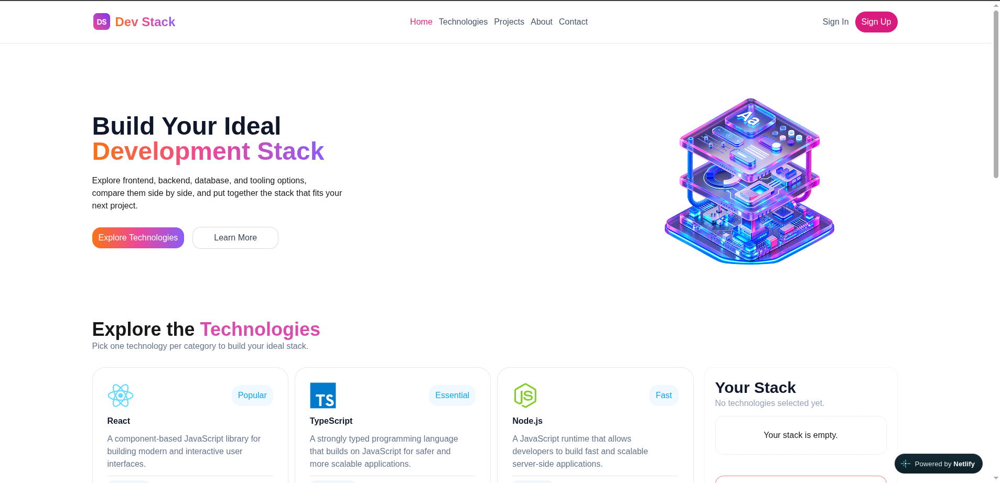
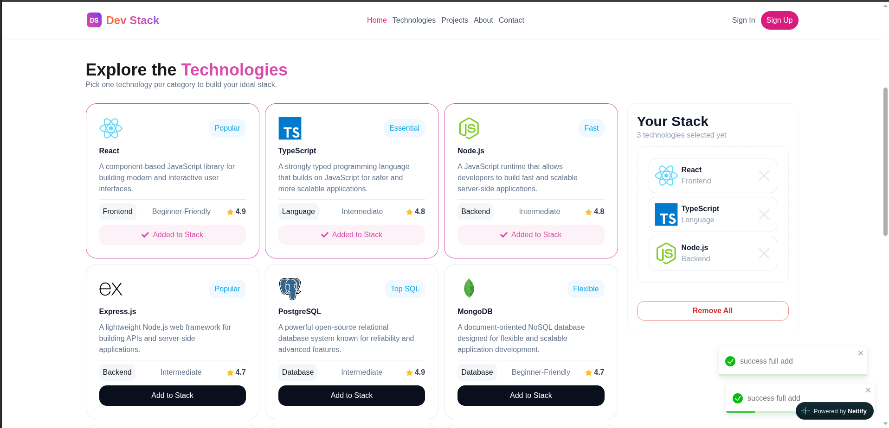

# 🚀 DevStack

DevStack is a simple web application that helps developers explore different technologies and build their own development stack.

## 🌐 Live Demo

https://kaleidoscopic-unicorn-e5870f.netlify.app/

## 🛠️ Technologies Used

<p>
  
  
  
  
  
  
</p>

## ✨ Features

### 1. Add Technology

Users can add a technology to their stack. After adding, the **Add to Stack** button is disabled and a toast message is shown.

### 2. Remove Technology

Users can remove a technology from their stack with a single click. A toast message is shown, and the **Add to Stack** button becomes active again.

### 3. Remove All

Users can remove all selected technologies at once by clicking **Remove All**. A toast message confirms the action.

## 📦 Dependencies

* React
* TypeScript
* Tailwind CSS
* DaisyUI
* React Toastify
* React Icons

## 🚀 Run Locally

Clone the repository and install the dependencies:

```bash
git clone https://github.com/ruhulaminislam/assignment-5.git
cd assignment-5
npm install
npm run dev
```

Then open the local development server in your browser.

## 📸 Screenshot

<p align="center">
  
</p>
...
<p align="center">
   
</p>

## 🔗 Relevant Links

* **Live Project:** https://kaleidoscopic-unicorn-e5870f.netlify.app/
* **GitHub Repository:** https://github.com/ruhulaminislam/assignment-5
